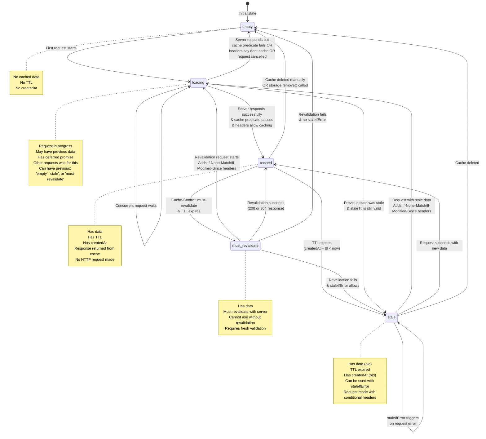

# Cache States & Transitions

This diagram shows all possible cache states and how they transition from one to another.



## State Descriptions

### empty
- **Data**: None
- **TTL**: None
- **Usage**: Initial state or after cache deletion
- **Next Actions**: First request will transition to `loading`

### cached
- **Data**: Fresh cached response
- **TTL**: Active (not expired)
- **Usage**: Response returned immediately from cache without network request
- **Next Actions**: 
  - Expires to `stale` when TTL runs out
  - Can transition to `must_revalidate` if Cache-Control requires it
  - Can be deleted manually to `empty`

### stale
- **Data**: Expired cached response
- **TTL**: Expired
- **Usage**: Can be returned with `staleIfError` on failures
- **Next Actions**: 
  - Next request transitions to `loading` with conditional headers (If-None-Match, If-Modified-Since)
  - Server may respond with 304 Not Modified (data unchanged) or 200 OK (new data)

### must-revalidate
- **Data**: Cached response requiring revalidation
- **TTL**: Expired with must-revalidate directive
- **Usage**: Cannot be used without server validation
- **Next Actions**: Must transition to `loading` for revalidation

### loading
- **Data**: May have previous stale data
- **TTL**: None (request in progress)
- **Usage**: Request is currently being made to server
- **Special**: 
  - Has deferred promise that other concurrent requests wait on
  - Tracks previous state (empty, stale, or must-revalidate)
  - May hydrate UI with stale data while loading
- **Next Actions**: Resolves to `cached` on success or `empty` on failure

## Common Transitions

### First Request (Cache Miss)
```
empty → loading → cached
```

### Cache Hit
```
cached (returns immediately, no state change)
```

### Cache Expiration
```
cached → stale → loading → cached
```

### Revalidation with 304 Not Modified
```
stale → loading → cached (with old data, updated TTL)
```

### Error with staleIfError
```
stale → loading → stale (error occurred, stale data returned)
```
