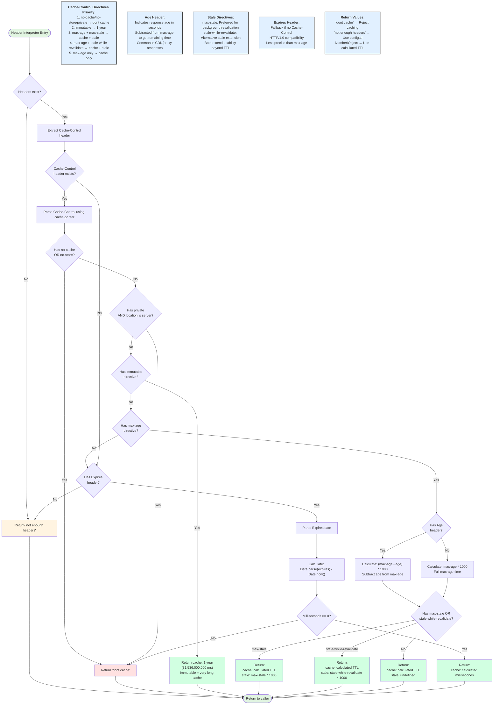

# Header Interpreter Flow

This diagram shows how HTTP response headers are interpreted to calculate cache TTL.



## Cache-Control Directives

### Directive Priority

1. **no-cache / no-store / private** → Don't cache
2. **immutable** → Cache for 1 year (very long TTL)
3. **max-age** → Primary TTL directive
4. **stale-while-revalidate / max-stale** → Extended stale TTL

### Age Header

The `Age` header indicates how old a response is (in seconds):
- Common in CDN/proxy responses
- Subtracted from `max-age` to get remaining cache time
- Example: `max-age=3600, Age=1000` → cache for 2600 more seconds

### Stale Directives

**max-stale** (preferred):
- Indicates how long stale data can be used
- Used for background revalidation scenarios

**stale-while-revalidate** (alternative):
- Alternative stale extension mechanism
- If both present, max-stale is preferred

## Expires Header

HTTP/1.0 compatibility:
- Used as fallback if no `Cache-Control`
- Contains absolute date/time
- Less precise than `max-age`
- Calculated as: `Date.parse(expires) - Date.now()`

## Return Values

### "dont cache"
Response should not be cached:
- `no-cache` or `no-store` present
- `private` on server-side
- `Expires` date in the past

### "not enough headers"
No caching headers found:
- Falls back to `config.ttl`
- Default behavior when server doesn't specify

### Number
Single TTL value in milliseconds:
- From `Expires` header
- Or from `max-age` without stale directives

### Object {cache, stale}
TTL with stale extension:
- `cache`: Primary TTL in milliseconds
- `stale`: Additional time stale data is acceptable

## Examples

### Immutable Resource
```
Cache-Control: immutable
→ cache for 1 year
```

### Standard TTL
```
Cache-Control: max-age=3600
→ cache for 1 hour
```

### With Age
```
Cache-Control: max-age=3600
Age: 1800
→ cache for 30 minutes (remaining)
```

### With Stale Extension
```
Cache-Control: max-age=3600, stale-while-revalidate=86400
→ cache: 1 hour, stale: 24 hours
```

### Don't Cache
```
Cache-Control: no-store
→ dont cache
```

## Related

- [Response Interceptor](/diagrams/response-interceptor) - How TTL is used
- [Cache States](/diagrams/cache-states) - What happens when TTL expires
