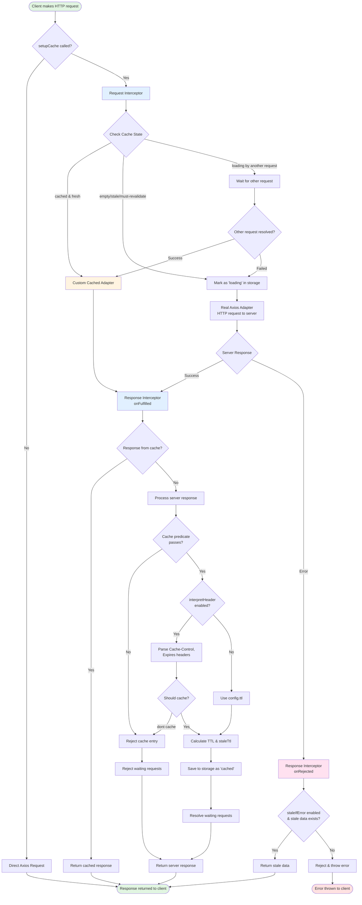

# Request/Response Flow Overview

This diagram shows the high-level overview of how a request flows through the axios-cache-interceptor system.

## Key Points

- **Green nodes**: Entry and exit points
- **Blue nodes**: Interceptor processing
- **Yellow nodes**: Cached adapter (no network request)
- **Red nodes**: Error paths

## Flow Explanation

1. **Request Entry**: When a request is made, it first checks if setupCache was called
2. **Request Interceptor**: Evaluates cache state and decides whether to use cache or make a network request
3. **Adapter**: Either uses cached data directly or makes an actual HTTP request
4. **Response Interceptor**: Processes the response and decides whether to cache it
5. **Error Handler**: Handles failures and can return stale data if configured

For more detailed flows, see:
- [Request Interceptor Details](/diagrams/request-interceptor)
- [Response Interceptor Details](/diagrams/response-interceptor)
- [Error Handler Details](/diagrams/response-error-interceptor)
