# Request Interceptor Flow

This diagram shows the detailed flow through the request interceptor, including all branching conditions and debug messages.

```mermaid
flowchart TB
    Start([Request Interceptor Entry]) --> GenKey[Generate cache key via generateKey]
    
    GenKey --> CheckDisabled{config.cache === false?}
    CheckDisabled -->|Yes| Debug1[Debug: 'Ignoring cache because config.cache === false']
    Debug1 --> ReturnConfig[Return config unchanged]
    
    CheckDisabled -->|No| MergeConfig[Merge defaults with per-request config]
    
    MergeConfig --> CheckIgnoreUrls{ignoreUrls<br/>configured?}
    CheckIgnoreUrls -->|Yes| TestIgnore{URL matches<br/>ignoreUrls?}
    TestIgnore -->|Yes| Debug2[Debug: 'Ignored because url matches ignoreUrls']
    Debug2 --> ReturnConfig
    TestIgnore -->|No| CheckAllowUrls
    
    CheckIgnoreUrls -->|No| CheckAllowUrls{allowUrls<br/>configured?}
    CheckAllowUrls -->|Yes| TestAllow{URL matches<br/>allowUrls?}
    TestAllow -->|Yes| Debug3[Debug: 'Cached because url matches allowUrls']
    Debug3 --> ApplyCacheTakeover
    TestAllow -->|No| Debug4[Debug: 'Ignored because url does not match any allowUrls']
    Debug4 --> ReturnConfig
    
    CheckAllowUrls -->|No| ApplyCacheTakeover{cacheTakeover<br/>enabled?}
    ApplyCacheTakeover -->|Yes| SetHeaders[Set headers:<br/>Cache-Control: no-cache, no-store<br/>Pragma: no-cache<br/>Expires: 0]
    ApplyCacheTakeover -->|No| CheckMethod
    SetHeaders --> CheckMethod
    
    CheckMethod{Method in<br/>cache.methods?}
    CheckMethod -->|No| Debug5[Debug: 'Ignored because method not in cache.methods']
    Debug5 --> ReturnConfig
    CheckMethod -->|Yes| GetCache[Get cache from storage]
    
    GetCache --> CheckCacheState{Cache state?}
    
    CheckCacheState -->|cached & fresh| IsCached[Cache is fresh]
    CheckCacheState -->|empty| IsEmpty
    CheckCacheState -->|stale| IsStale
    CheckCacheState -->|must-revalidate| IsMustRevalidate
    CheckCacheState -->|loading| IsLoading
    
    IsEmpty[State: empty] --> CheckOverride1{override === true?}
    IsStale[State: stale] --> CheckOverride1
    IsMustRevalidate[State: must-revalidate] --> CheckOverride1
    
    CheckOverride1 -->|No| CheckWaiting{Request ID in<br/>waiting map?}
    CheckOverride1 -->|Yes| CreateDeferred
    
    CheckWaiting -->|No| CreateDeferred[Create new deferred promise]
    CheckWaiting -->|Yes| GetCacheAgain[Get cache from storage again]
    
    GetCacheAgain --> DoubleCheckState{Still empty/<br/>must-revalidate?}
    DoubleCheckState -->|No| Debug6[Debug: 'Waiting list had a deferred, waiting for it']
    Debug6 --> WaitForDeferred[Wait for deferred & use cached response]
    WaitForDeferred --> PrepareReturn
    DoubleCheckState -->|Yes| CreateDeferred
    
    CreateDeferred --> AddToWaiting[Add deferred to waiting map]
    AddToWaiting --> SetLoading[Set storage state to 'loading']
    
    SetLoading --> CheckStale{Previous state<br/>was stale/must-revalidate<br/>AND not override?}
    CheckStale -->|Yes| UpdateStaleRequest[Add conditional headers:<br/>If-None-Match etag<br/>If-Modified-Since timestamp]
    CheckStale -->|No| SetValidateStatus
    UpdateStaleRequest --> Debug7[Debug: 'Updated stale request']
    Debug7 --> SetValidateStatus
    
    SetValidateStatus[Update validateStatus to accept 304] --> CheckHydrate{Has stale data<br/>& hydrate function?}
    CheckHydrate -->|Yes| Hydrate[Call hydrate function with stale data]
    CheckHydrate -->|No| Debug8
    Hydrate --> Debug8
    
    Debug8[Debug: 'Sending request, waiting for response'] --> ReturnConfig
    
    IsLoading[State: loading] --> GetDeferred{Deferred exists<br/>in waiting map?}
    GetDeferred -->|No| CheckLoadingHydrate{Has stale data<br/>& hydrate function?}
    CheckLoadingHydrate -->|Yes| HydrateLoading[Call hydrate function]
    CheckLoadingHydrate -->|No| ReturnConfig
    HydrateLoading --> ReturnConfig
    
    GetDeferred -->|Yes| Debug9[Debug: 'Detected concurrent request, waiting']
    Debug9 --> WaitDeferred[Wait for deferred promise]
    
    WaitDeferred --> DeferredResult{Promise resolved?}
    DeferredResult -->|Rejected| Debug10[Debug: 'Deferred rejected, requesting again']
    Debug10 --> CheckLoadingHydrate2{Has stale data<br/>& hydrate function?}
    CheckLoadingHydrate2 -->|Yes| HydrateRejected[Call hydrate function]
    CheckLoadingHydrate2 -->|No| RetryRequest
    HydrateRejected --> RetryRequest[Retry: Call onFulfilled again]
    RetryRequest --> Start
    
    DeferredResult -->|Resolved| GetStorageAgain[Get cache from storage again]
    GetStorageAgain --> CheckData{Data exists?}
    CheckData -->|No| Debug11[Debug: 'Deferred resolved but no data, requesting again']
    Debug11 --> RetryRequest
    CheckData -->|Yes| PrepareReturn
    
    IsCached --> PrepareReturn[Prepare cached response]
    PrepareReturn --> ClearTransform[Clear transformResponse<br/>to avoid double transformation]
    ClearTransform --> SetCachedAdapter[Set custom cachedAdapter that<br/>returns cached data immediately]
    SetCachedAdapter --> Debug12[Debug: 'Returning cached response']
    Debug12 --> ReturnConfig
    
    ReturnConfig --> End([Config returned,<br/>proceeds to adapter])
    
    style Start fill:#e1f5e1
    style End fill:#e1f5e1
    style ReturnConfig fill:#e1f0ff
    style Debug1 fill:#fff4e1
    style Debug2 fill:#fff4e1
    style Debug3 fill:#fff4e1
    style Debug4 fill:#fff4e1
    style Debug5 fill:#fff4e1
    style Debug6 fill:#fff4e1
    style Debug7 fill:#fff4e1
    style Debug8 fill:#fff4e1
    style Debug9 fill:#fff4e1
    style Debug10 fill:#fff4e1
    style Debug11 fill:#fff4e1
    style Debug12 fill:#fff4e1
    style IsEmpty fill:#ffe1e1
    style IsStale fill:#ffe8d1
    style IsMustRevalidate fill:#ffe8d1
    style IsLoading fill:#fff4e1
    style IsCached fill:#d1ffe1
```

## Key Decision Points

### URL Filtering
- **ignoreUrls**: Blacklist of URLs that should never be cached
- **allowUrls**: Whitelist of URLs (if configured, only these URLs are cached)

### Cache States
- **empty**: No cached data, will make network request
- **stale**: Has expired data, will revalidate with conditional headers
- **must-revalidate**: Must check with server before using
- **loading**: Request already in progress (concurrent access)
- **cached**: Fresh data available, returned immediately

### Concurrent Requests
When multiple requests for the same resource occur simultaneously:
1. First request creates a deferred promise and starts loading
2. Subsequent requests wait for the deferred promise
3. All requests share the same response once loaded

### Conditional Requests
For stale data, the interceptor adds headers to check if data changed:
- `If-None-Match`: With ETag value
- `If-Modified-Since`: With last modified timestamp

Server responds with:
- `304 Not Modified`: Data unchanged, use cached version
- `200 OK`: Data changed, new response provided

## Related

- [Response Interceptor](/diagrams/response-interceptor) - What happens after the request
- [Cache States](/diagrams/cache-states) - Understanding cache states
- [Debug Messages](/diagrams/debug-messages) - What each debug message means
